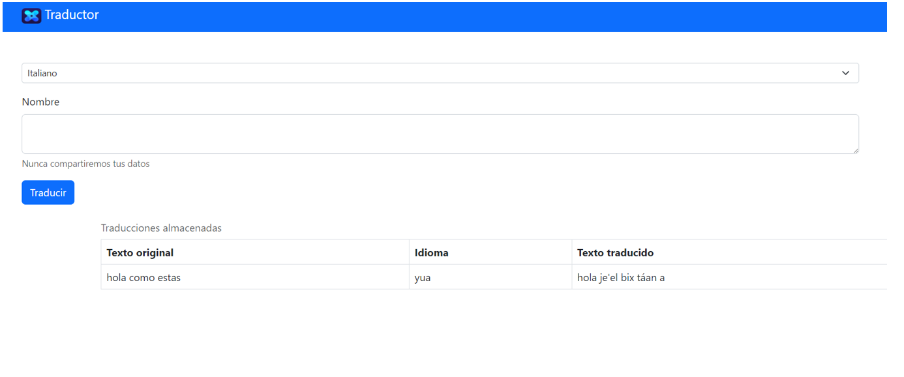

# Práctica 1: Ingeniería de Software para la Ciencia de los Datos

## Objetivo de la práctica:

Al finalizar la práctica, serás capaz de:

- Implementar Programación Orientada a Objetos (POO) en Python.
- Utilizar módulos y clases en Python.
- Asegurar la mantenibilidad y documentación del código.
- Implementar *testing unitario*.

## Duración aproximada:

- 60 minutos.

## Instrucciones:

### Tarea 1. Descripción de la tarea a realizar.
Paso 1. Debe de relatar el instructor en verbo infinito, claro y conciso cada actividad para ir construyendo paso a paso en el objetivo de la tarea.

Paso 2. <!-- Añadir instrucción -->

Paso 3. <!-- Añadir instrucción -->

### Tarea 2. Descripción de la tarea a realizar.
Paso 1. Debe de relatar el instructor en verbo infinito, claro y conciso cada actividad para ir construyendo paso a paso en el objetivo de la tarea.

Paso 2. <!-- Añadir instrucción -->

Paso 3. <!-- Añadir instrucción -->

### Resultado esperado
En esta sección, se debe mostrar el resultado esperado de nuestro laboratorio

